<h3> COMPTE RENDU </h3>
<h5> entité compte</h5>

<h5> Créer l'interface CompteRepository </h5>

<h5> Créer le Web service Restfull qui permet de gérer des comptes</h5>

<h5> Tester le web micro-service en utilisant un client REST comme Postman</h5>

<h5> Générer et tester le documentation Swagger de des API Rest du Web service</h5>

<h5>  Exposer une API Restful en utilisant Spring Data Rest en exploitant des projections</h5>
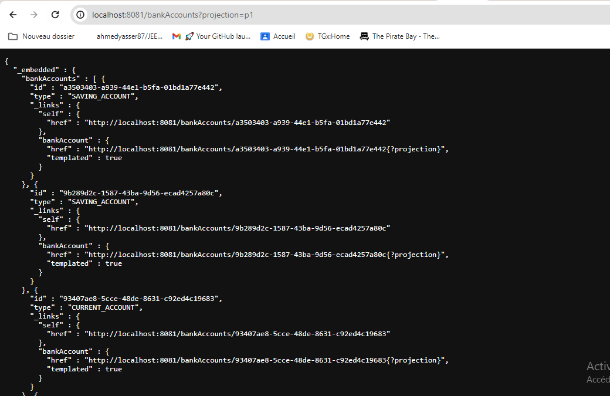

   <h5> Créer les DTOs et Mappers <\h5>

<h5>  Créer la couche Service (métier) et du micro service <\h5>

<h1>partie graphql</h1>
<h6>schema graphql</h6>
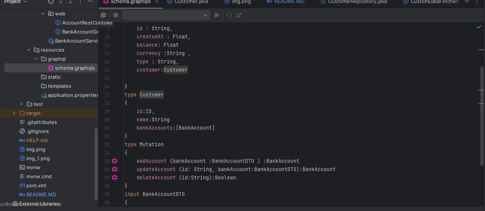
<h6>banqueaccountgraphql</h6>
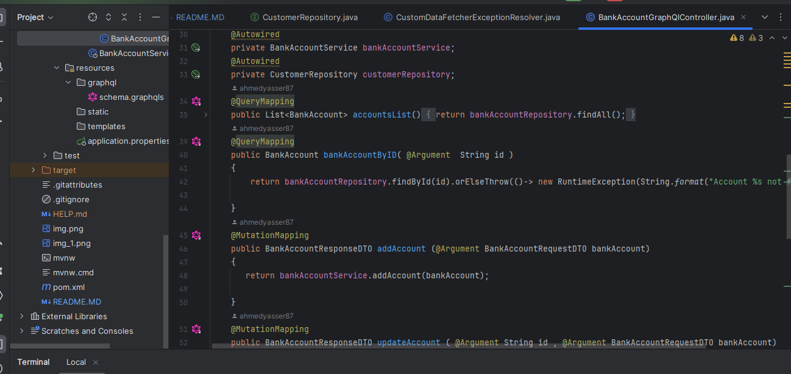
<h6>graphql web </h6>
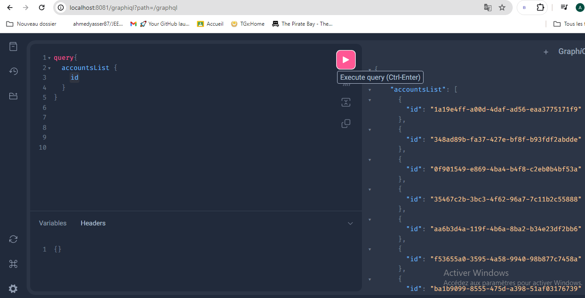
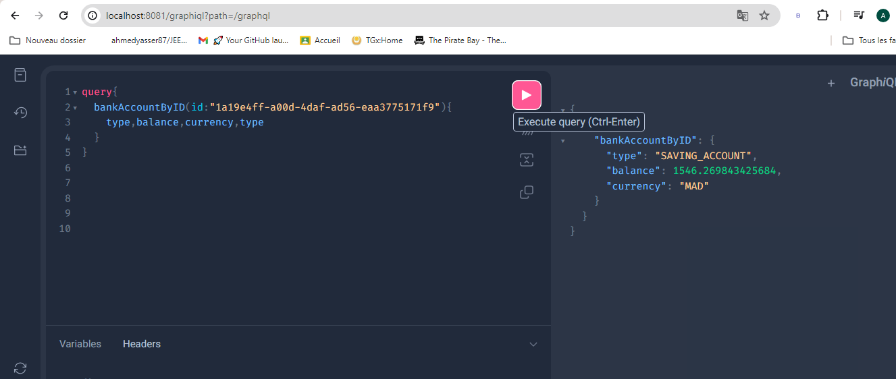

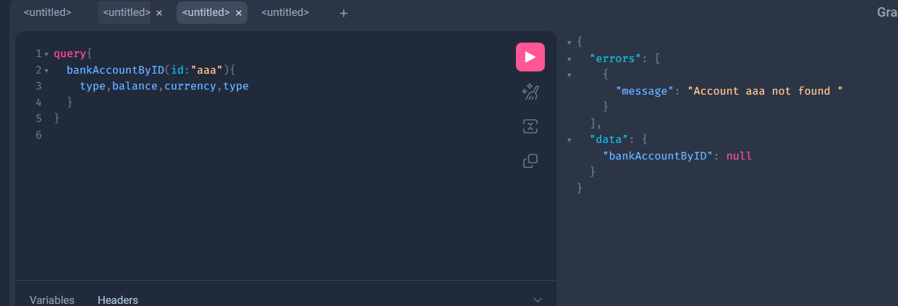
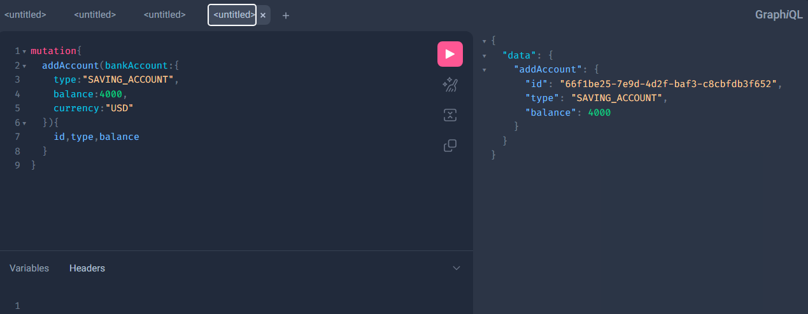
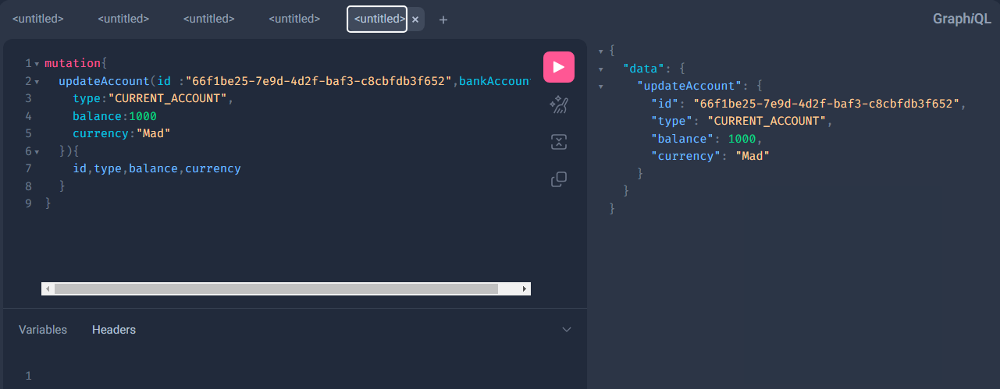
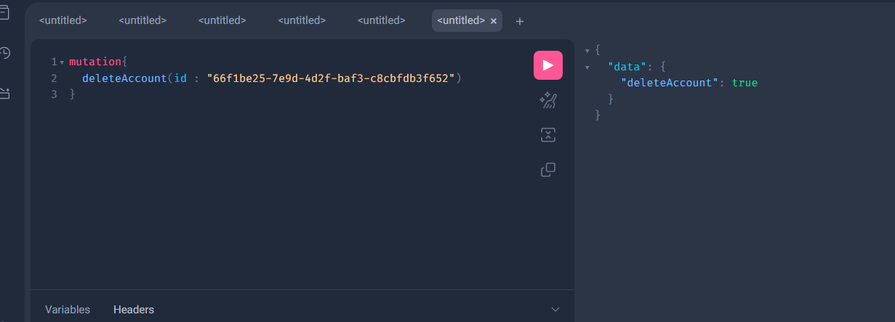
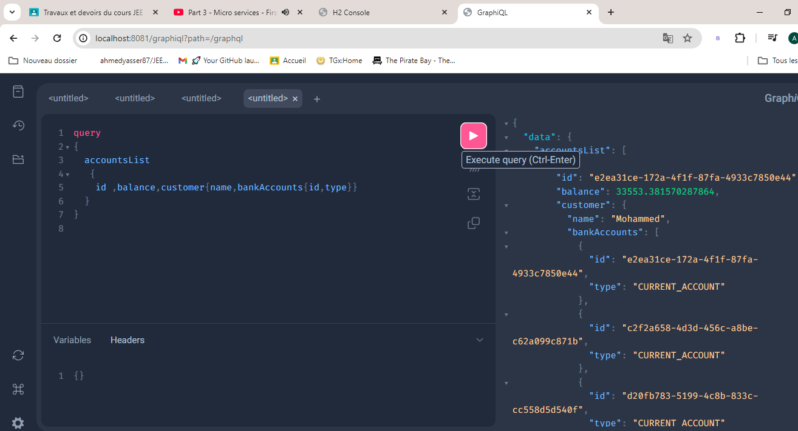
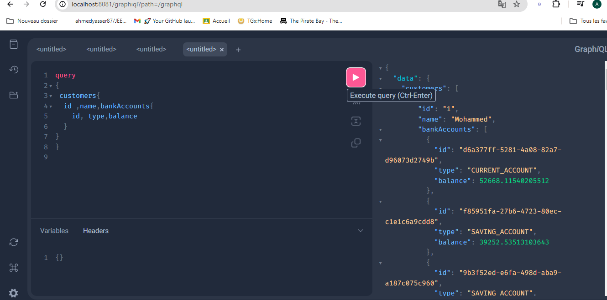

